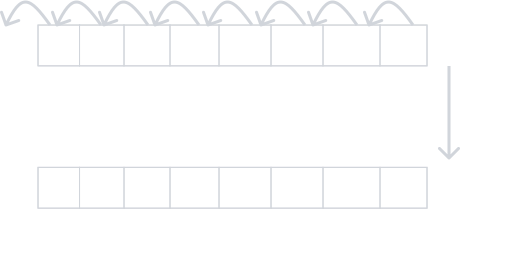

Bit manipulation is not a technique that comes often when writing code especially when dealing with higher level languages, regardless it is useful to understand how computers work behind the scene.

## Bit
The smallest data use to represent a piece of information in computers are bits and they represent an electrical current that is stored in a memory chip. This bit can either be on or off and the notation 1 and 0 from binary system is used to denote it's state.

## Byte
A collection of 8 adjacent bits form a byte or octet. Since it's comprised of 8 bits that can have the value either 1 or 0, a byte can have a value in the interval [0, 255] (2 to the power of 8 or 256 values).

### 6 representation in a byte:


Modern computer architechtures use memory registers of size four bytes (32-bit) or eight bytes (64-bit). 

## Endianness 

Endianess refers to the order the bytes are stored in a computer memory. The most common order in processor architecture is called Little-endian where the least significant byte (the byte that contains the smallest bits) is stored in the left or the smallest address memory. In contrast Big-endian will store the least significant byte on the right.

```cs
int a = 6; // integers ocupy 4 bytes 

// Little-endian (how ARM x86 and x64 architechtures work)
// 0000 0110  0000 0000  0000 0000  0000 0000

// Big-endian
// 0000 0000  0000 0000  0000 0000  0000 0110 
```

## Hexadecimal 

While binary system is used to represent the state of the memory capacitor that can only hold 2 states 1 or 0, hexadecimal system (base 16 numeral system) is usually used by memory diagnosters or when the state of the memory needs to be presented in a human readable form. One digit in hex system can represent 16 states or 4 bits which means each byte of data can represented by two hexadecimal digits.

```cs
int a = 79;

// binary:      0100 1111  0000 0000  0000 0000  0000 0000
// haxadecimal:   4    F     0    0     0    0     0    0

// haxadecimal without the spaces: 4F 00 00 00
```

## Bit operations

- Bitwise complement ( `~` ) -> 
Caclulates the complement of a bit pattern by reversing each bit

- Bitwise logical AND ( `&` ) ->
Compares two operands and returns a bit pattern that shows which bits are 1 in both of them

- Bitwise logical OR ( `|` ) ->
Compares two operands and returns a bit pattern that shows which bits are 1 in either one

- Bitwise logical XOR ( `^` ) ->
Compares two operands and returns a bit pattern that shows which bits are 1 only in one of the operands

- Bitwise left shift (`<< x`) operation will shift all bits to the left by x positions and esentially double the number for each shift.




- Bitwise right shift (`>> x`) operation will shift all bits to the right by x positions and esentially halve the number for each shift.


When shifting bits left/right the left-most/right-most bit will fall in the void of nothingness and disappears out of existence (dramatic music starts playing)

## Terminology

- Least siginificant bit (LSB) is the right most bit
- Most significant bit (MSB) is the highest or left most bit that is 1

## Bit manipulation tricks

#### Get first bit or LSB
```cs
var n = 5;
var bit = n & 1; // first bit is 1
```

#### Number of ones in a bit pattern or Hamming weight 
```cs
int HammingWeight(uint n) {
    int count = 0;
    while (n != 0) {
        var bit = n & 1;
        if(bit == 1) count++;
        n >>= 1;
    }
    return count;        
}
```

## Problems
- https://leetcode.com/problems/sum-of-two-integers/
- https://leetcode.com/problems/number-of-1-bits/
- https://leetcode.com/problems/counting-bits/