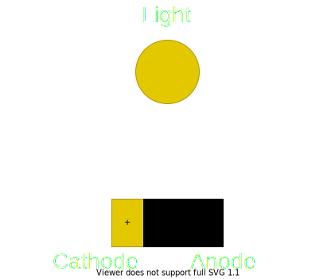

Electricity is the flow of electrons from the negative side, from a baterry for example, to the positive side of the baterry. The negative side is called anode and has a surplus of electrons and the positive side is called cathode and has a deficit of electrons. 



### Electric Current
Symbol is I from the french phrase intensité du courant, (current intensity) and it is measured in Amps(A).
Electric Current is the amount of electrons that flows through a conductor at the rate of 1 Coulomb (6.24 X 10^18 elecotrons) per second. 
```
1A = 1C / 1s 
```

### Voltage
The potential energy betwen two points or how strong the electrical current is flowing. 
Measured in Volts(V) which is how many Joules of energy is transfered for each Coulomb
```
1V = 1J / 1C
```

### Electrical power
Electrical power which can be calculated with this formula and is measued in Watts:
```
1W = 1A * 1V
```

### Resistance
A material resistance to electrical current. Measured in Ohms(Ω)