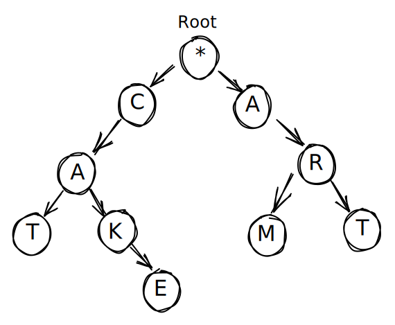

A trie or prefix tree is tree data structure that allows for fast searching of a key or string prefix in a dataset of strings. It is used in word completion like google search or intellisense



### Example implementation
```cs
public class Trie {

    private Node _root;
    
    public Trie() {
        _root = new Node();
    }
    
    public void Insert(string word) {
        var node = _root;
        foreach(char c in word) {
            if(!node.Children.ContainsKey(c)) {
                node.Children[c] = new Node();
            }
            
            node = node.Children[c];
        }
        node.IsWord = true;
    }
    
    public bool Search(string word) {
        var node = GetNode(word);
        if(node == null) {
            return false;
        }
        
        return node.IsWord;
    }
    
    public bool StartsWith(string prefix) {
        var node = GetNode(prefix);
        return node != null;
    }
    
    private Node GetNode(string word) {
        var node = _root;
        foreach(var c in word) {
            if(!node.Children.ContainsKey(c)) {
                return null;
            } else {
                node = node.Children[c];
            }
        }
        return node;
    }
}

public class Node
{
    public Dictionary<char, Node> Children { get; set; }
    public bool IsWord { get; set; }
    
    public Node() {
        Children = new Dictionary<char, Node>();
    }
}
```
