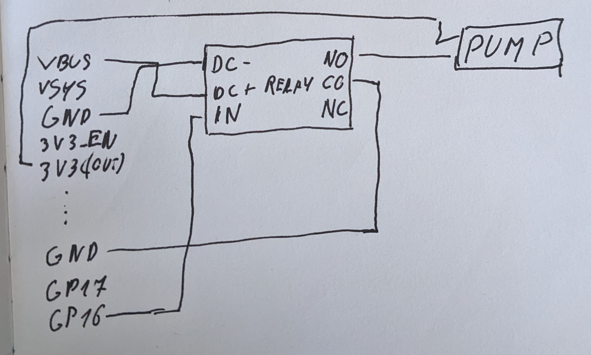
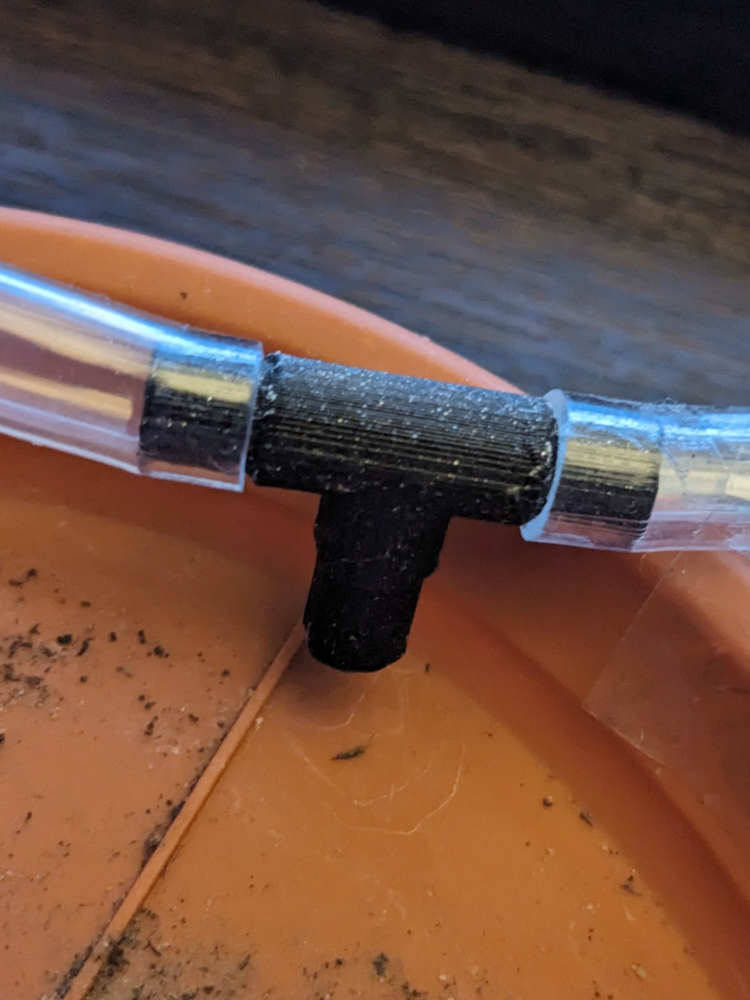

# Introduction

This project is meant to keep my plants healthy while I go on vacations.

# Part 1 - Prototype

## Parts required
- Raspberry Pi Zero (will work with any Raspberry Pi)
- micro usb power supply
- 3v-5v pump
- small hose for the pump
- 5v relay
- wires

## Wiring diagram


Relay inputs:
- NO = normally opened
- NC = normally closed
- CO = common
- DC- = ground
- DC+ = 5V signal
- IN = signal 

## Code

Simple python code to send a signal to pin 8 for 0.8 seconds which, in our case, will open the pump and water the plant.
```py
from time import sleep
import RPI.GPIO as GPIO

GPIO.setmode(GPIO.BOARD)
GPIO.setup(8, GPIO.OUT)

GPIO.output(8, GPIO.HIGH)
sleep(0.8)
GPIO.output(8, GPIO.LOW)

GPIO.cleanup()
```

Using linux cron jobs we can run the above program on a schedule:
 - run `crontab -e command` in the terminal
 - at the bottom of the file write the following line which will run water.py at 10:00 AM on Monday, Wednesday, Friday, and Saturday:
```
0 10 * * 1,3,5,6 python ~/projects/water.py
```

## Final result


## Syphon

One of the challenges I faced was the continued flow of water through the hose even after switching off the pump. The solution I came out with was to elevate the flower pot on a bowl so the end of the hose is higher and the syphon can't form.


# Part 2 - Raspberry Pi Pico

A linux computer like the Raspberry Pi Zero used in the prototype is overkill for this application and a more suitable candidate is a microcontroller like the Raspberry Pi Pico.

## Wiring diagram



## Code

I used Arduino IDE to write a simple program that will open the pump for 10 seconds every 2 days.

```
const unsigned long SECOND = 1000;
const unsigned long MINUTE = SECOND * 60;
const unsigned long HOUR = MINUTE * 60;
const unsigned long DAY = HOUR * 24;

int pin = 16;

void setup() {
  pinMode(pin, OUTPUT);

}

void loop() {
  openPump();
  delay(2 * DAY);                    
}

void openPump() {
  digitalWrite(pin, HIGH);
  delay(10 * SECOND);
  digitalWrite(pin, LOW);
}
```

## Result


## Useful links
- https://datasheets.raspberrypi.com/pico/Pico-R3-A4-Pinout.pdf


# Part 3 - Multiple plants

In order to water multiple plants I designed and 3d printed a simple T-shape connector:


I could have just made a hole in the hose for each pot but this is a bit more elegant solution.


# Part 4 - Improving the code

While Arduino studio is awesome, it didn't seem to have the best support for the Raspberry Pi Pico. The recommended languages for the Pico are C++ and Python and I decided to go with Python.

I rewrite the code in Python and did the following improvements:
- connect the board to wi-fi
- get the time from a NTP(Network Time Protocol) server
- open the pump every two days at 12:00 

Check the [github repo](https://github.com/danielmititelu/plant-watering-system) for the code.