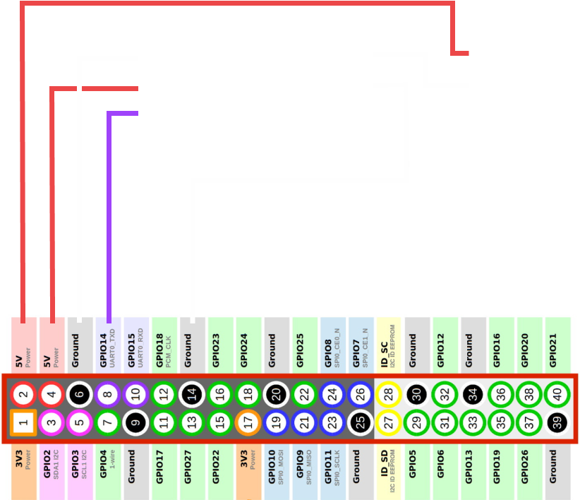
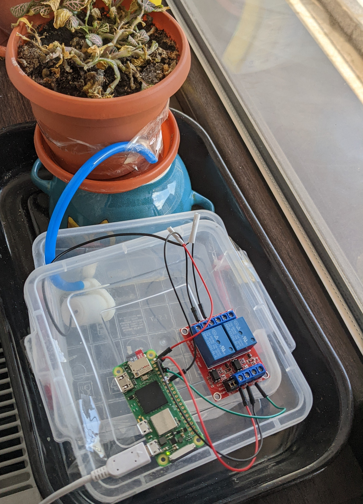

This project is meant to keep my plants healthy while I go on vacations.

## Parts required
- Raspberry Pi Zero (will work with any Raspberry Pi)
- micro usb power supply
- 3v-5v pump
- small hose for the pump
- 5v relay
- wires

## Wiring diagram


Relay inputs:
- NO = normally opened
- NC = normally closed
- CO = common
- DC- = ground
- DC+ = 5V signal
- IN = signal 

## Code

Simple python code to send a signal to pin 8 for 0.8 seconds which, in our case, will open the pump and water the plant.
```py
from time import sleep
import RPI.GPIO as GPIO

GPIO.setmode(GPIO.BOARD)
GPIO.setup(8, GPIO.OUT)

GPIO.output(8, GPIO.HIGH)
sleep(0.8)
GPIO.output(8, GPIO.LOW)

GPIO.cleanup()
```

Using linux cron jobs we can run the above program on a schedule:
 - run `crontab -e command` in the terminal
 - at the bottom of the file write the following line which will run water.py at 10:00 AM on Monday, Wednesday, Friday, and Saturday:
```
0 10 * * 1,3,5,6 python ~/projects/water.py
```

## Final result


# Syphon

One of the challenges I faced was the continued flow of water through the hose even after switching off the pump. The solution I came out with was to elevate the flower pot on a bowl so the end of the hose is higher and the syphon can't form.
