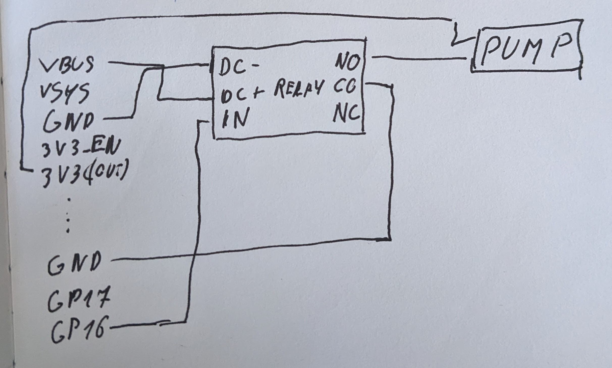

A linux computer like the Raspberry Pi Zero used in the prototype is overkill for this application and a more suitable candidate is a microcontroller like the Raspberry Pi Pico.

# Wiring diagram



# Code

I used Arduino IDE to write a simple program that will open the pump for 10 seconds every 2 days.

```
const unsigned long SECOND = 1000;
const unsigned long MINUTE = SECOND * 60;
const unsigned long HOUR = MINUTE * 60;
const unsigned long DAY = HOUR * 24;

int pin = 16;

void setup() {
  pinMode(pin, OUTPUT);

}

void loop() {
  openPump();
  delay(2 * DAY);                    
}

void openPump() {
  digitalWrite(pin, HIGH);
  delay(10 * SECOND);
  digitalWrite(pin, LOW);
}
```

# Result


# Useful links
- https://datasheets.raspberrypi.com/pico/Pico-R3-A4-Pinout.pdf